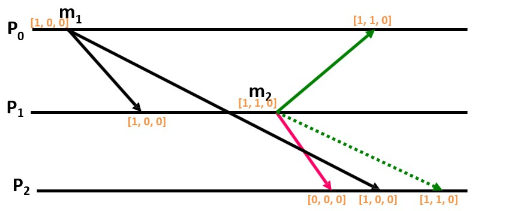
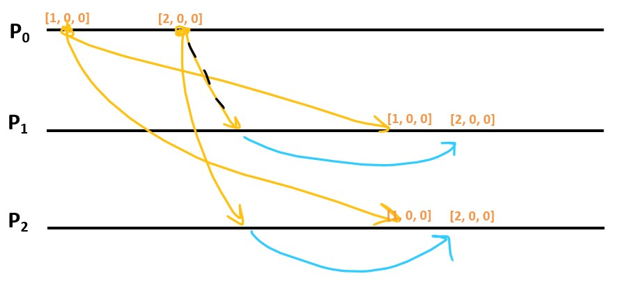

# Submission
### Scenarios
To run a different scenario, edit the scenario field in Process.java. The possible scenarios are:
- SLIDES (default). Process p0 broadcasts a message m1 in the first cycle. m1 is delayed for all processes other than p1. When p1 receives the message from p0, it broadcasts its own message m2. m2 arrives before m1 and the delivery is therefore postponed until after delivering m1. 

- SPAMMING. Each process broadcasts messages in the first 2 rounds (defined by a local variable rounds). However, the first message m1 from process 0 is delayed. Therefore, further messages from p0 are postponed until delivering m1.
- SECOND_MESSAGE_RECEIVED_FIRST. Equivalent to the first scenario, except both messages are sent by process 0. This scenario is meant to test self-delivery of messages coming from its own process. We found out that the vector clock should not be incremented (again) when delivering a message from itself.


### Adding a new process
1. Add a new line with <id name port> (e.g. "3 node3 9093") to addresses_docker.txt.
2. Add a new line with <id localhost port> (e.g. "3 localhost 9093") to addresses.txt.
3. Add new lines to docker-compose.yml with the following information:
    ```
    <name>: 
    build:
    ports: 
     - '<port>:8888'
       environment:
       RMI_PID: <id>
    ```
    e.g.
    ```
       node2:
       build: .
       ports:
        - '9092:8888'
          environment:
          RMI_PID: 2
    ```


# Java Template
This code is offered as a template for the course IN4150.
This template is tested on Ubuntu 20.04 (should also work on Windows and Mac OSX).

## File structure
- **nl.tudelft.bartcox/src:** Holds all the java source files
- **resources/addresses.txt:** List of the addresses of all the processes that are participating in the algorithm.
- **resources/addresses_docker.txt:** Same but then for the docker implementation because the hostnames are different.
- **resources/my.policy:** Java RMI permissive policy to remove all firewall/security issues
- **Dockerfile:** Dockerfile describing the image that is used by docker-compose
- **docker-compose.yml:** Yaml file that describes the system for docker-compose.

## Remarks
1. Feel free to change any of the files. This template is offered as starting point with working messaging between distributed processes.
2. `addresses_docker.txt` is loading into the docker image as `addresses.txt`. You don't have to change the source code when switching from running locally for debugging to running with docker-compose.
3. Both `addresses.txt` and `addresses_docker.txt` follow the structure of `<processId> <hostname/ip/> <port>` for each line.
## Prerequisites
* Docker
* Docker-compose

## Run via docker-compose
```bash
docker-compose build
docker-compose up
```

Expected output:
```text
Attaching to in4150-java-template_node0_1, in4150-java-template_node1_1
node0_1  | Process Id = 0
node1_1  | Process Id = 1
node0_1  | Binding to: rmi://node0:9091/0
node1_1  | Binding to: rmi://node1:9092/1
node0_1  | Finished setting up communication
node1_1  | Finished setting up communication
node0_1  | Process 0 got message"Hello world. Message 5" from process 1
node0_1  | 
node1_1  | Process 1 got message"Hello world. Message 5" from process 0
node1_1  | 
node0_1  | Process 0 got message"Hello world. Messages 4" from process 1
node0_1  | 
node1_1  | Process 1 got message"Hello world. Messages 4" from process 0
node1_1  | 
node0_1  | Process 0 got message"Hello world. Messages 3" from process 1
node0_1  | 
node1_1  | Process 1 got message"Hello world. Messages 3" from process 0
node1_1  | 
node0_1  | Process 0 got message"Hello world. Messages 2" from process 1
node0_1  | 
node1_1  | Process 1 got message"Hello world. Messages 2" from process 0
node1_1  | 
node1_1  | Process 1 got message"Hello world. Messages 1" from process 0
node1_1  | 
node0_1  | Process 0 got message"Hello world. Messages 1" from process 1
node0_1  | 
node1_1  | Process 1 is finished
node0_1  | Process 0 is finished
da-lab_node1_1 exited with code 0
da-lab_node0_1 exited with code 0

```

## Run locally (for debugging)
```bash
# Compile source files
javac *.java
# Bundle class files into a jar file
jar -cf RMIServer.jar *.class
# Execute code with custom security policy
java -Xmx4096m -Djava.security.policy=my.policy -cp RMIServer.jar RMIServer 0 &
java -Xmx4096m -Djava.security.policy=my.policy -cp RMIServer.jar RMIServer 1 &
# As many commands as there are nodes in your algorithm/implementation
java -Xmx4096m -Djava.security.policy=my.policy -cp RMIServer.jar RMIServer n &
```

Expected output is the same as when running with docker-compose.
